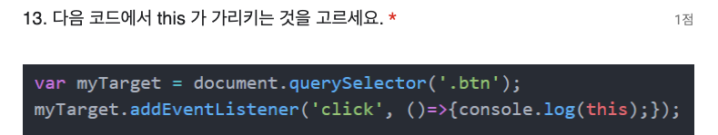
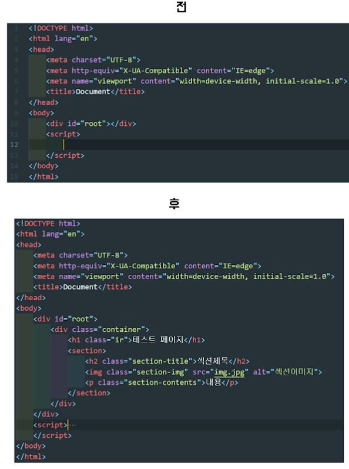

(1기)EST 오르미 프론트엔드 과정 중간 평가
daon0912@gmail.com 계정 전환

초안 저장됨

- 표시는 필수 질문임
  프론트엔드 과정 중간 평가: 문제

1. 다음 중 float 을 해제하는 방법으로 적절한 것을 고르세요.

- 1점
  Float 된 요소에 display:inline-block 속성을 부여한다.
  Float 된 요소의 부모요소에 clear:both 속성을 부여한다.
  Float 된 요소의 다음 형제요소에 overflow:hidden 속성을 부여한다.
  Float 된 요소의 부모요소에 overflow:hidden 속성을 부여한다.

2. 다음 중 css 선택자 우선순위(가중치)가 올바른 것을 고르세요.

- 1점
  !important > ID 선택자 > class 선택자 > 가상 요소 선택자
  Inline 스타일 > !important > 가상클래스 선택자 > class 선택자
  가상 요소 선택자 > class 선택자 > 가상클래스 선택자 > 요소선택자
  ID 선택자 > 가상클래스 선택자 > 요소 선택자 > 가상 요소 선택자

3. 다음 중 웹페이지의 로딩이 느릴 경우 고려해야 할 사항이 아닌 것을 고르세요.

- 1점
  사용되는 이미지의 용량
  올바른 css 선택자의 사용
  자바스크립트 최적화
  브라우저 리플로우(reflow)를 일으키는 속성 제거

4. <button> 과 <input> 요소에 대한 설명으로 올바른 것을 고르세요.

- 1점
  <button> 요소의 기본 타입은 button 이다.
  <input> 요소는 인라인 요소임으로 자식으로 인라인 요소만 감싸줄수 있다.
  <button> 요소는 컨텐츠를 중앙으로 정렬하는 기본 스타일을 가진다.
  <button>의 submit 타입의 성능이 <input>의 submit 보다 우수하다.

5. 다음 속성에 대한 설명 중 틀린 것을 고르세요.

- 1점
  src 속성은 필요한 소스의 경로를 나타냅니다.
  href 속성은 하이퍼링크가 가리키는 URL을 나타냅니다.
  alt 속성은 요소에 대한 설명으로 마우스를 호버하면 툴팁을 표시합니다.
  lang 속성은 요소 내에 사용된 언어를 정의합니다. 6. 다음 중 display:inline 에 대한 설명으로 올바른 내용을 고르세요.
- 1점
  normal flow 에 존재할 때 float 된 요소를 알아보지 못한다.
  한 라인을 모두 차지하는 특징이 있다.
  마진 탑(margin-top)값의 설정이 불가능하다.
  display:inline 요소의 자식으로는 반드시 inline 요소만 가능하다.

7. HTML 요소에 대한 설명으로 틀린 것을 고르세요

- 1점
  
 태그는  문단을 나타냅니다.
  <head> 태그는 소개 및 탐색에 도움을 주는 콘텐츠를 나타냅니다.
  <article> 태그는 사이트 안에서 독립적으로 구분해 재사용할 수 있는 구획을 의미합니다.
  <body> 태그는 html 문서의 내용을 나타냅니다.
  8.다음 중 document의 body 자식노드를 가져오는 명령어는?
- 1점
  body.childNodes
  document.childNodes
  document.body.childNodes
  window.body.childNodes

9. 아래 A, B 중 A 요소를 중앙정렬(가로)을 하고자 합니다. 다음 설명 중 올바른 것을 고르세요.

- A : 정렬하고자 하는 요소 / B : A를 감싸고 있는 컨테이너
  1점
  B에 margin: 0 auto 속성을 부여한다.
  A에 display:flex, align-items: center 속성을 부여한다.
  B에는 position: relative 속성을, A에겐 position: absolute, left:50% 속성을 부여한다.
  B에게 display:flex, justify-content:center 속성을 부여한다.

10. 다음은 flex에 대한 설명입니다. 올바르지 않은 설명을 하는 사람을 고르세요.

- 1점
  파이: flex는 부모를 통해 자식들을 컨트롤할 수 있어!
  썬: 그리고 직계자식까지만 영향을 줄 수 있지.
  빙키: flex-item들은 기본적으로 Axis 기준으로 정렬되기 때문에 기본 방향은 위쪽에서 아래쪽이야!
  뮤라: flex-direction이 column일 때 가로로 중앙정렬을 하고 싶다면 align-item을 center로 설정하면 된대.

11. 다음 CSS 코드가 주어졌을 때, 이 코드가 생성하는 배경의 특징으로 올바른 것은 무엇인가요?

- .element {
  background: url('pattern.jpg') repeat-x top / 100px 100px #f0f0f0;
  height: 300px;
  width: 100%;
  }
  1점
  단색 배경 위에 패턴 이미지가 상단에서 가로로 반복되며, 이미지의 크기는 100px x 100px이다.
  패턴 이미지가 요소 전체를 채우며, 배경색은 보이지 않는다.
  단색 배경 위에 패턴 이미지가 세로로 반복되며, 이미지의 크기는 원본 크기 그대로이다.
  패턴 이미지가 요소의 중앙에 한 번만 나타나며, 나머지 부분은 단색으로 채워진다.

12. 다음 중 JavaScript class 문법에 대한 설명으로 틀린 것을 고르세요.

- 1점
  class 선언 내의 모든 코드는 strict 모드로 작동한다.
  class 선언은 호이스팅된다.
  new 키워드 없이 class 생성자를 호출할 수 없다.
  constructor는 class내에 반드시 있어야 한다.

13. 다음 코드에서 this 가 가리키는 것을 고르세요.
    

- 1점
  캡션 없는 이미지
  document 인터페이스
  Window 전역객체
  myTarget 이 바라보는 요소
  click 이벤트 타입

14. 다음 Array 메서드 중 return 값이 undefined인 것은?

- 1점
  find
  filter
  map
  forEach

15. 다음 중 promise와 연계할 수 있는 명령어가 아닌 것은?

- 1점
  then
  catch
  try
  finally

16. 다음 중 SASS에서 Extend를 사용하기 위한 키워드로 알맞은 것은? (@extend ?클래스명, ? 안에 들어갈 문자열을 고르세요.)

- 1점
  @
  %
  $
  &

17. bootstrap의 container는 1개의 row안에 몇 colum으로 이뤄져 있나요?

- 1점
  8
  10
  12
  16

18. (jQuery)ul 안에 li가 5개 있습니다. 3번째 요소 이상(3번째 li, 4번째 li, 5번째 li)부터 color를 red로 변경하는 코드는 무엇인가요?

- 1점
  캡션 없는 이미지
  $('ul').children('li:gt(3)').css('color', 'red');
$("li").ge(2).css("color", "red" );
  $('ul').children('li:gt(2)').css('color', 'red');
$('ul').children('li:gt(1)').css('color', 'red');

19. <a> 태그 사용시 새 탭으로 열기 설정을 위한 속성과 값을 고르세요.

- 1점
  target="\_self"
  href="\_self"
  target="\_blank"
  href="\_blank"

20. 'abcde1abc12abb'와 같은 문자열이 주어졌을 경우 이 안에 주어진 모든 숫자를 한자리씩 더하는 프로그램을 메서드 체이닝을 통해 완성하세요. 위 문제의 경우 1 + 1 + 2 = 4가 나와야 합니다. 'abcde1abc12abb'.split('') 부터 시작하시면 됩니다.

- 2점

21. (DOM API 사용, 부분점수 허용) script 부분을 완성하여 '전' 파일에서 '후' 파일이 되게 해주세요.

- 3점
  
  2/3페이지
  Google Forms를 통해 비밀번호를 제출하지 마세요.
  이 콘텐츠는 Google이 만들거나 승인하지 않았습니다. 악용사례 신고 - 서비스 약관 - 개인정보처리방침
  Google 설문지
